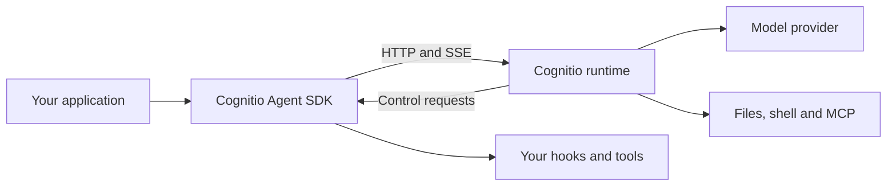

Cognitio Agent SDK is a TypeScript toolkit for agents that use tools, maintain sessions, stream their work, and ask your application for permission. It is **built on OpenCode** and ships its own version-matched runtime.

Start with `Agent` for a reusable application component, `query()` for a single streamed task, or `createAgentClient()` when you need explicit session and server ownership.

```ts
import { Agent, shutdown } from "cognitio-agent-sdk"

const agent = new Agent({
  model: "anthropic/claude-sonnet-4-5",
  instructions: "You explain software clearly and concisely.",
  maxTurns: 4,
  disallowedTools: ["*"],
})
try {
  const result = await agent.run("Explain what a transaction is.")
  console.log(result.text)
} finally {
  await agent.close().finally(() => shutdown())
}
```

[Run your first agent](/quickstart) · [Explore the public API](/api-reference/index) · [Browse working examples](/cookbook/examples)

## One SDK, two deployment modes

In local mode, the SDK starts a bundled native runtime and owns its lifecycle. In remote mode, it connects to a runtime you operate. The same sessions, tools and event model work through both paths.



## Build the behavior you need

Use [custom tools](/concepts/tools), [subagents](/concepts/subagents), [skills and plugins](/concepts/skills-commands-plugins) to extend an agent. Keep your application's policy in [permissions and hooks](/concepts/permissions). Inspect [usage and telemetry](/concepts/observability), request [structured output](/concepts/structured-output), and [rewind file changes](/concepts/checkpoints).

V2 targets the capabilities recorded in its [Claude SDK comparison](/migration/claude-agent-sdk). It has its own API and supports multiple model providers. Python, managed sandboxes and durable scheduled jobs are outside this release.
